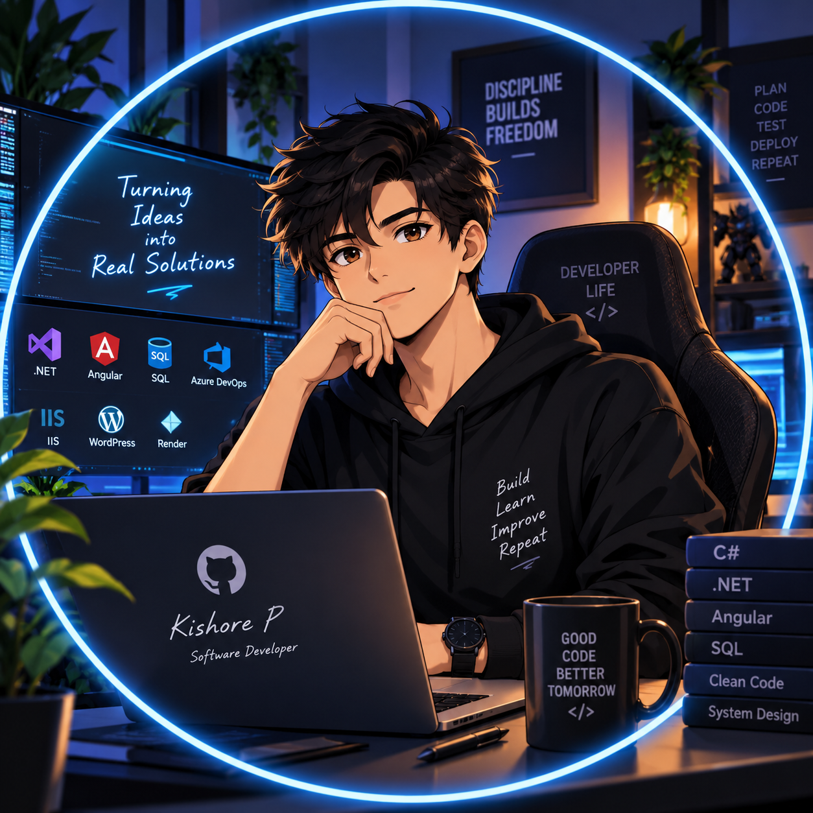

<div align="center">



# 👋 Hi, I'm Kishore P

### Software Developer • Full-Stack Development • .NET • Angular

<p>
  <a href="https://github.com/kishore12022002">
    
  </a>
  <a href="https://www.linkedin.com/in/kishore-p-bb41ba283/">
    
  </a>
  <a href="mailto:kishore12022002@gmail.com">
    
  </a>
</p>


</div>

---

## 👨‍💻 About Me

I'm a **Software Developer** currently working as a **Full-Stack Developer** in a private company.

I enjoy building reliable web applications, backend services, REST APIs, database-driven systems, and modern frontend experiences.

My main development focus is the **Microsoft .NET ecosystem**, together with **Angular and TypeScript**.

🎓 **B.Tech. Information Technology** — A.V.C College of Engineering

---

## 🧰 Tech Stack

### Backend
<p>
  
</p>

**C# • .NET • .NET Framework • ASP.NET • REST APIs**

### Frontend
<p>
  
</p>

**Angular • HTML • CSS • JavaScript • TypeScript**

### Database
<p>
  
</p>

**SQL / Database Development**

### DevOps & Tools
<p>
  
</p>

**Git • GitHub • Azure DevOps • NuGet • IIS • Render**

### Other
**WordPress**

---

## 🚀 Featured Project

### 🔄 Swagger Conversion

A tool built to help convert Swagger/OpenAPI documentation between versions, making API documentation migration easier.

**Built with:**

` .NET 8 ` ` HTML ` ` CSS `

> More projects will be added here as I continue building and publishing.

---

## 💼 What I Work With

```text
Backend Development       ████████████████████
Frontend Development      ██████████████████░░
REST API Development      ███████████████████░
Database Development      █████████████████░░░
DevOps & Deployment       ███████████████░░░░░
```

- ⚙️ Backend and business logic
- 🌐 Web application development
- 🔗 REST API development & integration
- 🗄️ SQL/database development
- 🅰️ Angular frontend development
- 🚀 CI/CD and Azure DevOps workflows
- 📦 NuGet package management
- 🖥️ IIS deployment
- ☁️ Render deployment
- 🌍 WordPress development

---

## 📊 GitHub Statistics

<div align="center">


</div>

---

## 🔥 Contribution Streak

<div align="center">


</div>

---

## 📈 Contribution Graph

<div align="center">


</div>

---

## 🎯 Currently Focused On

- 🚀 Building better full-stack applications
- ⚙️ Improving .NET and C# development
- 🅰️ Growing Angular & TypeScript skills
- 🔗 Building and integrating REST APIs
- 🗄️ Improving database design and performance
- ☁️ Learning and improving deployment workflows
- 🧠 Writing cleaner, maintainable code

---

## 🧠 My Developer Philosophy

> **Build → Learn → Improve → Repeat.**

I believe good software comes from continuously learning, solving real problems, and improving every version.

---

## 🤝 Let's Connect

<div align="center">

<a href="https://github.com/kishore12022002">
  
</a>
<a href="https://www.linkedin.com/in/kishore-p-bb41ba283/">
  
</a>
<a href="mailto:kishore12022002@gmail.com">
  
</a>

</div>

<br>

<div align="center">


### ⭐ Thanks for visiting my profile!

**Keep Building. Keep Learning. Keep Improving. 🚀**

</div>
